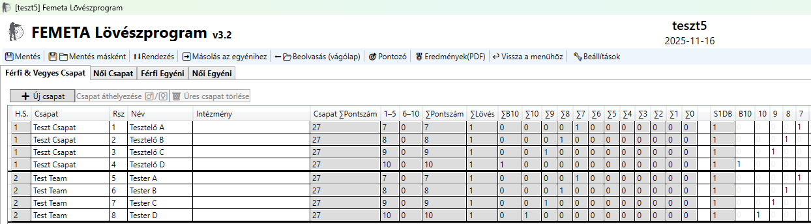
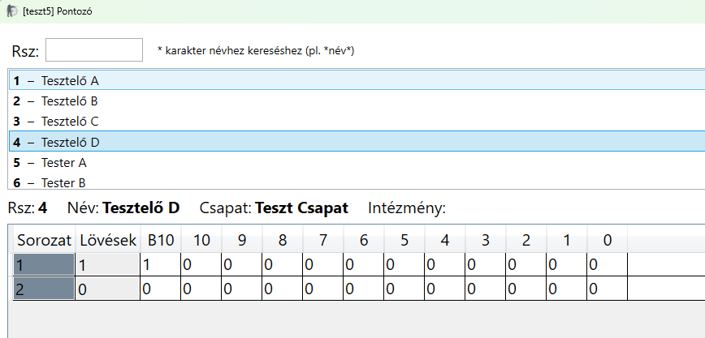
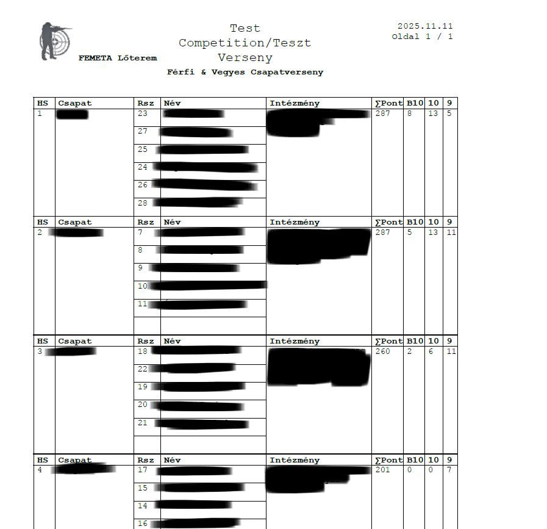

# FEMETA Competition Manager (WPF/.NET 8)

## What it is
An offline competition scoring app for airgun matches (individual + teams), built to be fast and reliable on-site.

## Why I built it
Before the program, scoring started in Excel with macros. It worked, but it was hard to maintain and easy to break with small user mistakes (sorting, merged/grouped rows, accidental edits). Then the workflow was moved into a dedicated app with clear inputs, guardrails, and consistent outputs.

## Problems it solves
- Fast on-site input, designed to run smoothly even on low-spec laptops
- Automatic rankings (individual + team) with tie handling
- Category-based A4 PDF exports with clean pagination
- Fewer user errors (validation, duplicate checks, save prompts)

## Tech stack
- C# / WPF / MVVM (.NET 8)
- JSON persistence + autosave (backup history)
- PDF export (PDFsharp/MigraDoc)

## Showcase

<b>Main Menu</b>

<b>Scorer (Helps to record scores fast)</b>

<b>Generated PDF</b>

## Next improvements
- Enhanced training statistics and graphs