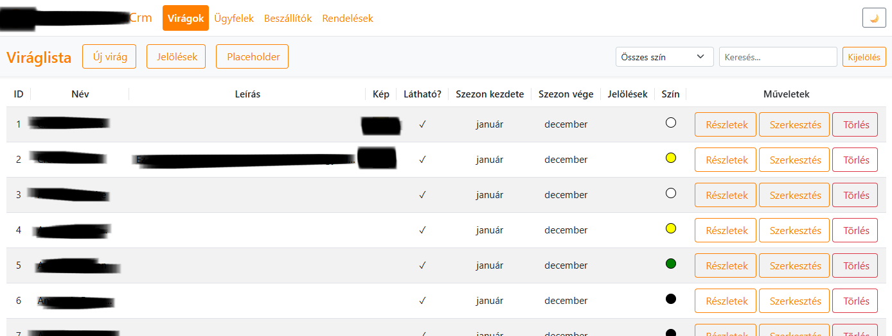
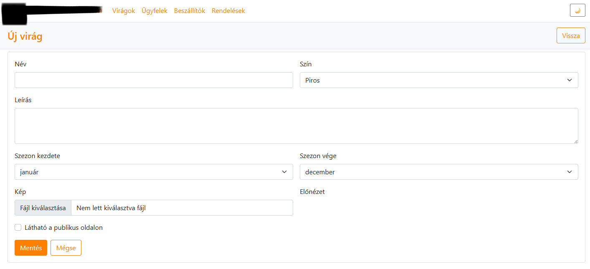
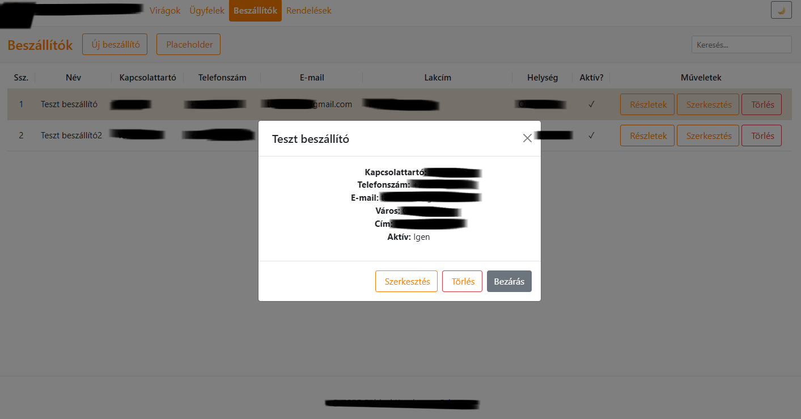

# Virág Nagyker CRM (ASP.NET Core + PostgreSQL)

## Mi ez?
Egy domain-specifikus CRM virág nagyker munkafolyamatokra: vevők, beszállítók, termékek (virágok) és rendelések kezelése reszponzív felülettel és gyors keresés/szűrés funkciókkal.

## Miért készült?
A folyamat eleinte papíralapú volt, majd táblázatkezelőbe került. Ez elérhetőbb lett, de továbbra is sok hibalehetőséget hagyott (következetlen adatbevitel, nehéz státuszkövetés, kézi másolgatás). A CRM ugyan ezet a munkát egy dedikált rendszerbe hajtja végre: strukturált űrlapokkal, validációval és átláthatóbb áttekintéssel és egyben több bővítési és testreszabási lehetőséggel.

## Milyen problémákat old meg?
- Egységes nyilvántartás vevőkre/beszállítókra/termékekre/rendelésekre
- Gyors keresés/szűrés/rendezés a mindennapi munkához
- Kevesebb felhasználói hiba (validáció, következetes adatbevitel)
- Megbízhatóbb riportolás és ismételhető munkafolyamatok (kézi táblázat-műveletek helyett)

## Tech stack
- ASP.NET Core MVC
- EF Core + PostgreSQL
- Bootstrap (reszponzív UI)
- Újrahasznosítható partial view-k / modálok CRUD műveletekhez

## Bemutató

 
<b>Virágok áttekintése</b>

 
 
<b>Virágok hozzáadása</b>

 
 
<b>Beszállító modal</b>

## Next improvements
- Szerepkörök/jogosultságok + audit napló
- PDF munkafolyamatok (nyomtatható rendelőlapok / visszaigazolás)
- Mentések + visszaállítás, import sablonok
- Követések / emlékeztetők és vevői státuszok
- További mobil optimalizálás